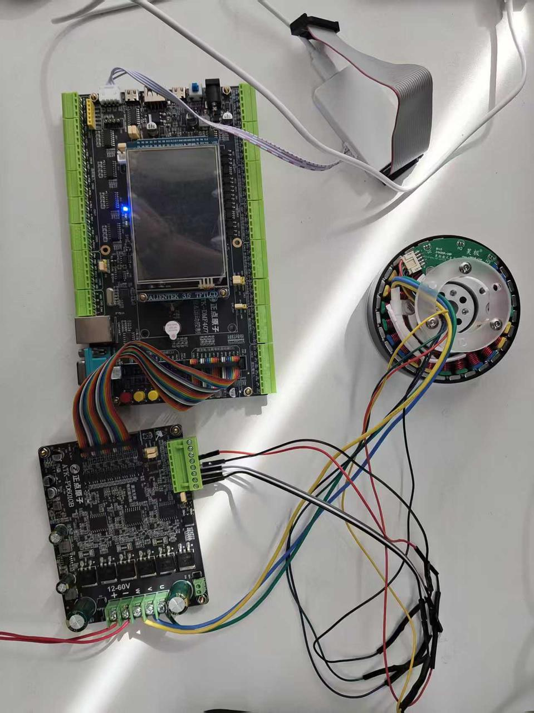
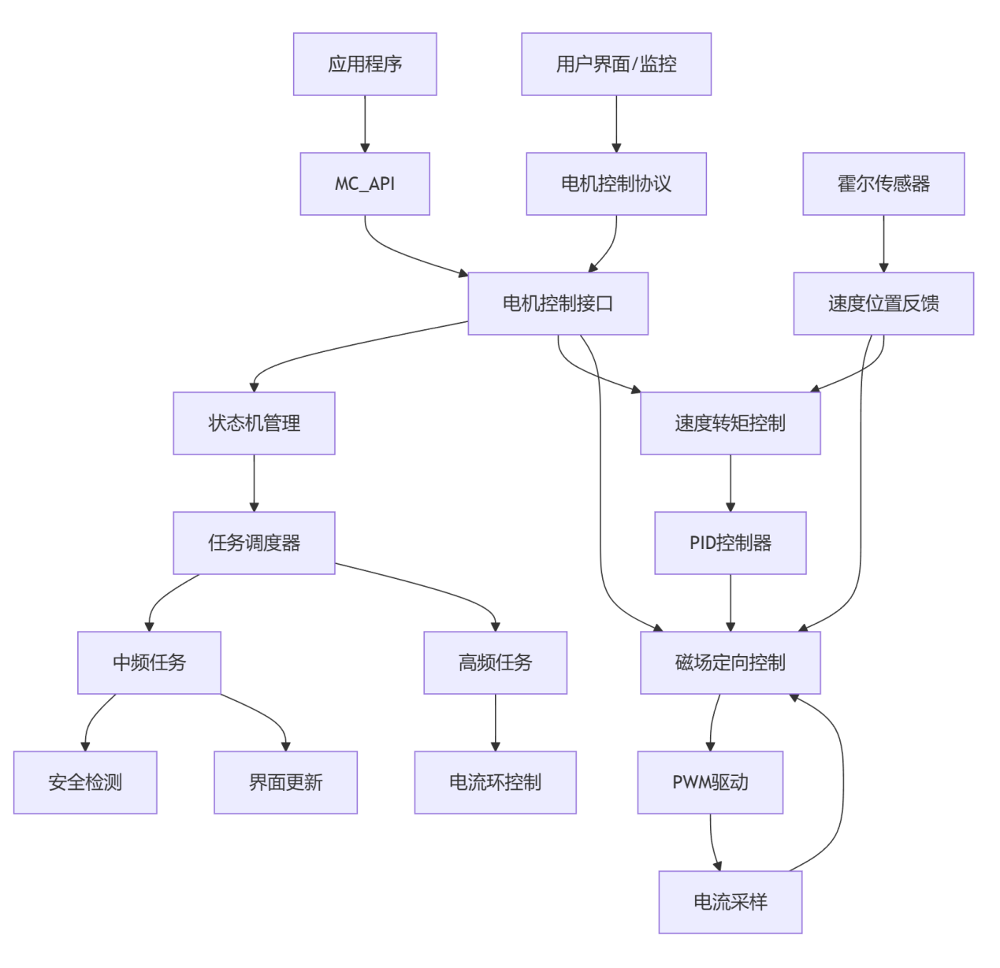

# STM驱动霍尔电机运动控制流程
## 配置

### 硬件

1. 昊极8110电机
2. 正点原子STM32F407IG开发板 + PD6010B驱动板
3. 直流电源
4. 烧录器Dap-Link

### 软件

1. X-CUBE-MCSDK 5.4.8 + STM32CubeMX 5.6.0（必须在6.4.0版本以下）+ Java Runtime Environment 1.8.0_45
2. Keil
3. 参考示例代码：【正点原子】电机驱动板&电机资料\2，ATK-PD6010B直流无刷驱动板资料\1，实例程序\实验10 PMSM_FOC专题实验\FOC_速度模式控制_霍尔驱动（接口1）

### 硬件连接



## 电机控制系统设计流程

1. 用MotorControl Workbench 5.4.8打开foc_pmsm_m1_hall.stmcx，修改外设与电机参数


2. 自动生成代码
    Tools->Generation->GENERATE
    
    
    
    
    
3. 烧录

在Keil中打开MDK-ARM\foc_pmsm_m1_hall.uvprojx，注意芯片选择，Options for Target中选择Output->Create HEX File，在Debug->Settings中查看烧录器是否被检测，Build，Load

4. 按下Key 2开启或关闭电机，重新烧录后可按下Reset

## **代码系统架构思路**

### **分层架构设计**

```
应用层 (Application)
    ↓
电机控制API层 (MC_API)
    ↓
电机控制接口层 (MC_Interface)
    ↓
核心控制层 (FOC算法、状态机、PID控制)
    ↓
硬件抽象层 (PWM、ADC、GPIO等外设驱动)

```

---

### **主要组件交互关系**

**系统架构示意图**



### **详细函数调用流程**

**系统初始化流程**

```
main()
└── MX_MotorControl_Init()                    // motorcontrol.c
    ├── HAL_SYSTICK_Config()                  // 配置SysTick
    ├── MCboot()                              // mc_tasks.c
    │   ├── STM_Init(&STM[M1])               // 状态机初始化
    │   ├── R3_2_Init(&PWM_Handle_M1)        // PWM初始化
    │   ├── PID_HandleInit(&PIDSpeedHandle_M1)// PID初始化
    │   ├── HALL_Init(&HALL_M1)              // 霍尔传感器初始化
    │   ├── STC_Init(pSTC[M1])               // 速度转矩控制初始化
    │   ├── RVBS_Init(pBusSensorM1)          // 电压传感器初始化
    │   ├── NTC_Init(&TempSensorParamsM1)    // 温度传感器初始化
    │   └── MCI_Init(oMCInterface[M1])       // MC接口初始化
    └── UI_TaskInit()                         // ui_task.c
        ├── UI_Init(&pDAC->_Super)           // UI初始化
        └── MCP_Init(pMCP)                   // 电机控制协议初始化

```

**实时控制任务流程**

```
SysTick_Handler()                            // stm32f4xx_mc_it.c
└── MC_RunMotorControlTasks()                // mc_tasks.c
    ├── MC_Scheduler()                       // 任务调度器
    │   └── TSK_MediumFrequencyTaskM1()      // 中频任务
    │       ├── HALL_CalcAvrgMecSpeedUnit()  // 计算平均速度
    │       ├── PQD_CalcElMotorPower()       // 计算电机功率
    │       ├── STM_GetState()               // 获取状态机状态
    │       ├── MCI_ExecBufferedCommands()   // 执行缓冲命令
    │       ├── FOC_CalcCurrRef()            // 计算电流参考值
    │       └── 状态机切换处理
    ├── TSK_SafetyTask()                     // 安全任务
    │   ├── TSK_SafetyTask_PWMOFF()          // 安全检测
    │   │   ├── NTC_CalcAvTemp()            // 温度检测
    │   │   ├── PWMC_CheckOverCurrent()      // 过流检测
    │   │   ├── RVBS_CalcAvVbus()           // 电压检测
    │   │   └── STM_FaultProcessing()        // 故障处理
    │   └── RCM_ExecUserConv()               // 执行用户ADC转换
    └── UI_Scheduler()                       // UI调度器

```

**高频FOC控制流程**

```
ADC_IRQHandler()                             // ADC中断
└── TSK_HighFrequencyTask()                  // 高频任务
    └── FOC_CurrControllerM1()               // FOC电流控制器
        ├── SPD_GetElAngle()                 // 获取电角度
        ├── PWMC_GetPhaseCurrents()          // 获取相电流
        ├── MCM_Clarke()                     // Clarke变换
        ├── MCM_Park()                       // Park变换
        ├── PI_Controller()                  // PI控制器
        ├── Circle_Limitation()              // 电压限制
        ├── MCM_Rev_Park()                   // 反Park变换
        └── PWMC_SetPhaseVoltage()           // 设置PWM电压

```

**用户命令处理流程**

```
// 速度斜坡命令
MC_ProgramSpeedRampMotor1()                  // mc_api.c
└── MCI_ExecSpeedRamp()                      // mc_interface.c
    → 设置命令缓冲器
    → MCI_ExecBufferedCommands()             // 在合适时机执行
        └── STC_ExecRamp()                   // 执行速度斜坡

// 启动命令
MC_StartMotor1()
└── MCI_StartMotor()
    └── STM_NextState(IDLE_START)            // 切换状态机状态

```

**通信协议处理流程**

```
USART_IRQHandler()                           // 串口中断
└── UFCP_RX_IRQ_Handler()                    // 接收处理
    → MCP_ReceivedFrame()                    // 协议解析
        ├── UI_SetReg()                      // 设置寄存器
        ├── UI_ExecCmd()                     // 执行命令
        └── UI_ExecSpeedRamp()               // 执行速度斜坡

```

### 呈现效果

[呈现效果](docs/808d4b760fbf4f4e97441a4b3b59ba09.mp4)

### Documents

[https://www.notion.so](https://www.notion.so)
