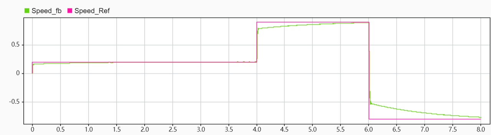
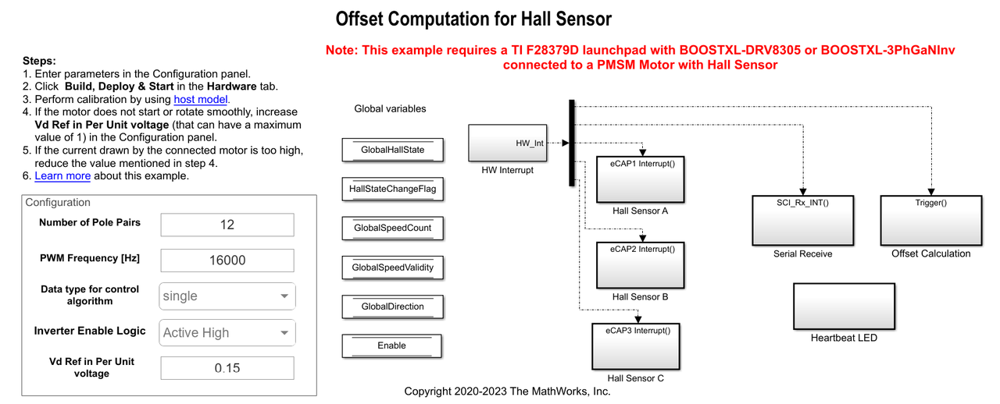

# TI驱动霍尔电机运动控制流程
## 配置

1. 硬件
    1. 上位机 - USB - TI Delfino F28379D LaunchPad - BOOSTXL-DRV8305EVM驱动板 - 昊极8110电机
    2. 24V直流电源
2. 软件
    1. Matlab 2023b + Simulink及配套附加功能
    2. 参考示例代码：帮助文档 - [**Field-Oriented Control of PMSM Using Hall Sensor**](https://www.mathworks.com/help/releases/R2023b/mcb/gs/foc-pmsm-using-hall-sensor-example.html?searchHighlight=HALL&s_tid=doc_srchtitle)
3. 硬件连接

注意相序


## 电机控制系统设计流程

1. 仿真目标模型并观测仿真结果。
    
    打开mcb_pmsm_foc_hall_f28379d.slx。
    
    
    
    打开该目录下mcb_pmsm_foc_hall_f28379d_data.m，注意修改电机参数与PI参数。
    
    ```
    %% Controller design // Get ballpark values!
    PI_params = mcb_SetControllerParameters(pmsm,inverter,PU_System,T_pwm,Ts,Ts_speed);
    
    % 手动覆盖为安全参数
    PI_params.Kp_i = 2;
    PI_params.Ki_i = 0.1;
    PI_params.Kp_id = 2;
    PI_params.Ki_id = 0.1;
    PI_params.Kp_speed = 0.3;
    PI_params.Ki_speed = 0.1;
    
    ```
    
    ```
    %% System Parameters
    % Motor parameters
    pmsm = mcb_SetPMSMMotorParameters("custom");
    pmsm.Rs = 1.02;          % 定子电阻 (Ohm)
    pmsm.Ld = 0.00059;       % D轴电感 (H)
    pmsm.Lq = 0.00059;       % Q轴电感 (H) - 假设Ld = Lq
    pmsm.FluxPM = 0.0323;    % 永磁体磁链 (Wb) - 计算得出，见下方说明
    pmsm.p = 12;             % 极对数
    pmsm.I_rated = 4.0;      % 额定电流 (A) - 峰值
    pmsm.N_rated = 2000;     % 额定转速 (RPM)
    pmsm.Vdc = 24.0;         % 直流母线电压 (V)
    % 可选参数
    pmsm.J = 1e-4;           % 转动惯量 (kg·m²) - 估计值，需要调整
    pmsm.B = 1e-5;           % 摩擦系数 - 估计值
    pmsm.PositionOffset = PositionOffset;         % Per-Unit position offset
    
    ```
    
    开始仿真。在数据检查器中勾选参考转速与实际转速，得到曲线如图所示，根据转速跟随情况调整PI参数。
    
    
    
2. 完成硬件连接。
3. 模型会自动计算模数转换器 (ADC) 或电流偏移值。
    
    要禁用此功能（默认启用），请在模型初始化脚本中将变量 inverter.ADCOffsetCalibEnable 的值更新为 0。也可以计算 ADC 偏移值，并在模型初始化脚本中手动更新它。有关说明，请参阅以开环控制方式运行三相交流电机并校准 ADC 偏移量。
    
4. 计算霍尔传感器偏移值，并在与目标模型相关联的模型初始化脚本中更新它。
    
    打开PMSM的霍尔偏移量校准模型mcb_pmsm_hall_offset_f28379d.slx，修改参数后编译烧录。若偏移量设置不当，观察到电机将固定在某位置无法转动，且随着电流不断增大，电机剧烈振动，直到电流过大触发保护。
    
    
    
    打开对应host model，开始仿真。若反转则任意交换两相线。校正结束后偏移量显示，输出到Matlab工作区变量PositionOffet。
    
    
    
5. 按所需的硬件配置打开目标模型mcb_pmsm_foc_hall_f28379d.slx，编译烧录。
6. 在目标模型中，打开关联的主机模型host model。
    
    
    
    打开电机开关，分别设置参考转速为30RPM，80RPM， 130RPM，观察现象。
    


Speed_ref = 30RPM


Speed_ref = 80RPM


Speed_ref = 130RPM

### 呈现效果

[呈现效果.mp4](docs/ecc689d214fc800350b15442edbde559.mp4)

### Documents

[https://www.notion.so](https://www.notion.so)
